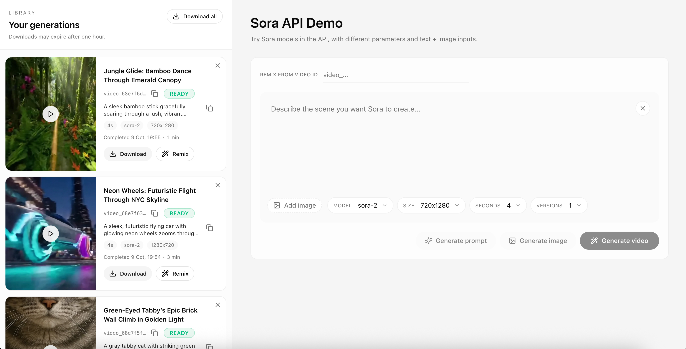

# Sora Video API sample app

[](LICENSE)


This repository contains a NextJS sample app built on top of the [Sora Video API](https://platform.openai.com/docs/guides/video-generation) and OpenAI SDK.
It provides a simple UI for experimentation, using text prompts and optionally image inputs to generate and remix videos.



Features:

- Generate new videos or remix existing runs through the `/videos` endpoints.
- Queue multiple variations in one click with **Versions Count** and follow progress via automatic polling.
- Auto-title runs so finished clips stay recognizable.
- Automatically optimize prompts.
- Generate starter imagery with `gpt-image-1` to use as image inputs.
- Preview, download, remix, or retry completed runs directly from the history panel.
- Persist preferences and run history in `localStorage` so refreshes do not wipe context.

This app is meant to be used as a starting point to build Sora-powered video experiences that you can customize to your needs.

## How to use

1. **Get access to the Sora Video API:**

   - Sora is currently in limited availability. Request access through your OpenAI account team or the [Video API waitlist](https://openai.com/waitlist/sora).
   - Once approved, review the [video generation guide](https://platform.openai.com/docs/guides/video-generation) to understand supported parameters and limits.

2. **Set the OpenAI API key:**

   2 options:

   - Export the `OPENAI_API_KEY` environment variable [globally on your machine](https://platform.openai.com/docs/libraries#create-and-export-an-api-key).
   - Create a `.env.local` file at the project root (see below)

   ```bash
   OPENAI_API_KEY="your-openai-api-key"
   ```

3. **Clone the repository:**

   ```bash
   git clone https://github.com/openai/sora-starter-app.git
   ```

4. **Install dependencies:**

   Run in the project root:

   ```bash
   npm install
   ```

5. **Run the app:**

   ```bash
   npm run dev
   ```

   The app will be available at [`http://localhost:3000`](http://localhost:3000).

## Video helpers

This sample app highlights common Sora workflows and wraps each one in a small UI helper to speed up iteration.

### Generate new videos

- Fill in your prompt, choose a Sora model (`sora-2` or `sora-2-pro`), aspect ratio, and duration (4s, 8s, or 12s).
- Optionally upload an image; the app crops it to the chosen aspect ratio before sending it along as `input_reference`.
- Submit one or many variations at once via **Versions Count**. The sidebar polls `/videos/{id}` until each job completes.

### Remix existing runs

- Paste an existing `video_id` into the Remix section or click **Remix** on a completed run.
- Adjust prompt, model, size, or duration and resubmit. The history keeps both parent and remix entries linked for fast comparison.

### Prompt optimization

Use **Generate prompt** to call the Responses API to optimize your prompt for the selected model, size, and duration.

### Image ideation

- Let `gpt-image-1` propose stills aligned with your prompt. Choose the one you like and send it as the next `input_reference`.
- Swap between generated and uploaded imagery without losing form state.

### Run management

- Preview, download, remix, or retry finished runs without leaving the page.
- Remove unwanted runs from the history and bulk download completed clips.

## Demo flows

### Try a fresh generation

- Enter a descriptive prompt such as `A sweeping drone shot over neon-drenched Kyoto at night`.
- Select `sora-2-pro`, set duration to 8 seconds, and bump **Versions Count** to 3.
- Click **Generate**. Watch each run stream through queued → processing → completed states, then preview the outputs inline.

### Try a remix

- Pick your favorite completed clip and hit **Remix**.
- Add guidance like `with a vintage film grain feel` and submit. Compare the remix to the original using the preview overlay navigation.

### Try prompt and image suggestions

- Click **Suggest prompt** after entering a rough idea—e.g., `A playful golden retriever in the snow`—and apply the refined version.
- Ask for image ideas, select one of the generated stills, and run a new generation to see how the reference shapes the motion.

## Contributing

You are welcome to open issues or submit PRs to improve this app, however, please note that we may not review all suggestions.

## License

This project is licensed under the MIT License. See the LICENSE file for details.
